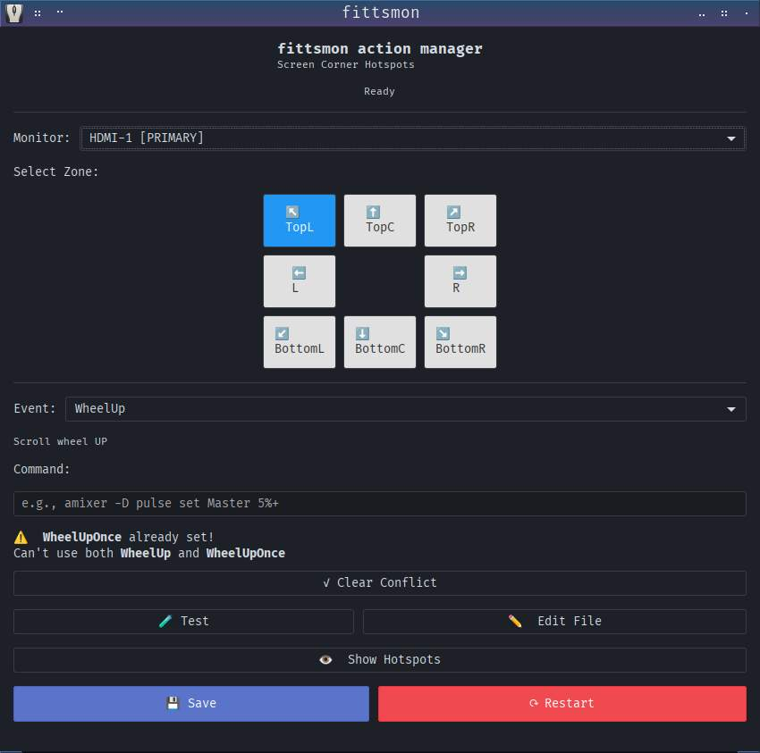
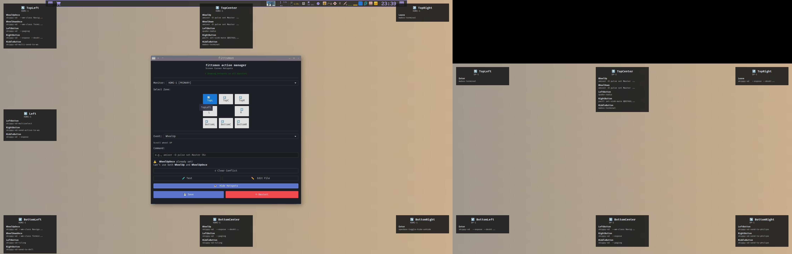

[fittsmon-gui & picom](https://github.com/musqz/fittsmon-gui/blob/main/images/picom-trans-round-corners.jpg)

# fittsmon-gui

Lightweight GTK3 GUI to configure `fittsmon` screen-corner hotspots.

What this repository contains
- `fittsmon-gui.py` — the GTK3 GUI application (run with Python 3)
- `install.sh` — installs the program, manpage, `.desktop` file, and icon to `$PREFIX` (defaults to `/usr/local`)
- `uninstall.sh` — removes installed files
- `fittsmon-gui.1` — man page (installed gzipped)
- `icons/` — application icon(s) (hicolor theme layout)
- `README_INSTALL.md` — quick install instructions


Quick usage
- Run from source (no install):

```bash
python3 fittsmon-gui.py
```

- Install system-wide (copies files to `$PREFIX` and updates caches):

```bash
chmod +x install.sh
sudo ./install.sh
```

- Uninstall:

```bash
chmod +x uninstall.sh
sudo ./uninstall.sh
```
# Manpage

```
man fittsmon-gui
man fittsmon
```

# Trouble shooting

1. If `fittsmon-gui` is not reading the config file right.

 - Check if the primary monitor is correctly set as primary in your display settings.
 - This can be done with a tool like `arandr` for openbox.

 **Why this matters:** The configuration file relies on the primary monitor being designated correctly. If it's not set properly, fittsmon won't read the settings correctly.

2. If fittsmon is not reacting after closing fittsmon-gui, use `Alt-F2` to reload fittsmon as daemon.

```
fittsmon --monitor arg arg
```

# Configuration

Config location:

- User configuration is saved to `~/.config/fittsmon/fittsmonrc`.

**Notes** (explicit paths)

When you run `sudo ./install.sh` without setting `PREFIX`, the default `PREFIX` is `/usr/local`. Files will be placed as follows:

- Binary: /usr/local/bin/fittsmon-gui
- Man page: /usr/local/share/man/man1/fittsmon-gui.1.gz
- Desktop file: /usr/local/share/applications/fittsmon-gui.desktop
- Icon (hicolor theme): /usr/local/share/icons/hicolor/scalable/apps/fittsmon-gui.svg

If you install with `PREFIX=/usr`, files will be placed under `/usr` instead:

- Binary: /usr/bin/fittsmon-gui
- Man page: /usr/share/man/man1/fittsmon-gui.1.gz
- Desktop file: /usr/share/applications/fittsmon-gui.desktop
- Icon (hicolor theme): /usr/share/icons/hicolor/scalable/apps/fittsmon-gui.svg

**License**
- GNU General Public License v2.0 or later

**Prerequisite**
- This GUI requires the `fittsmon` daemon to be installed and available on your system.
- Install `fittsmon` from the upstream repository:

```bash
git clone https://gitlab.com/muzlabz/fittsmon.git
cd fittsmon
# Follow the project README to build/install fittsmon
```

Project repository (fittsmon): https://gitlab.com/muzlabz/fittsmon.git

### Disclaimer & AI Notice

**No Warranty**: This software is provided AS-IS without any warranty of any kind.

**AI-Assisted Code**: This project was developed with assistance from:
- GitHub Copilot
- Other AI code generation paid tools (like codex claude-haiku-4-5 model)

While tested in personal use, code quality cannot be guaranteed for all edge cases.
Users are responsible for:
- Testing before production use


See [LICENSE](LICENSE) for full legal terms.
